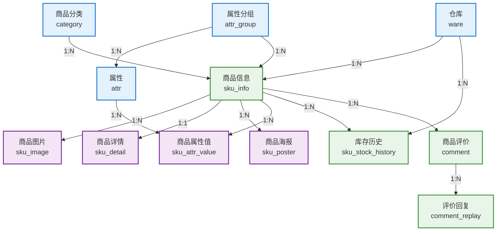
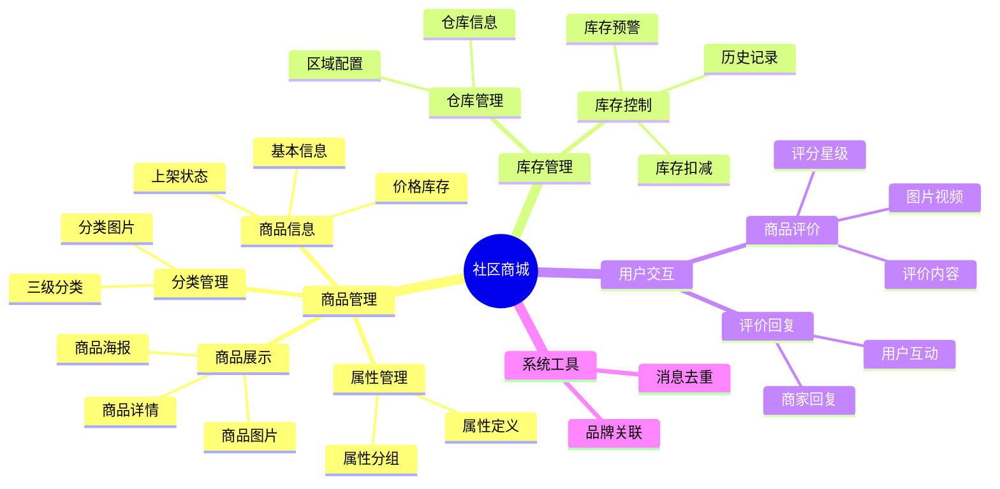
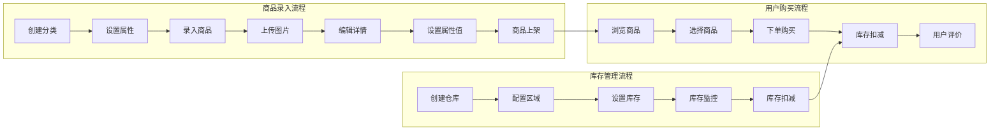

# 社区商城核心业务关系图

## 核心实体关系图

## 业务模块划分

## 数据流向图

## 关键业务规则

### 1. 商品管理规则
- 每个商品必须属于一个分类
- 每个商品必须关联一个属性分组
- 商品属性值必须基于预定义的属性
- 商品上架前必须通过审核

### 2. 库存管理规则
- 商品库存不能为负数
- 锁定库存用于已下单但未支付的订单
- 库存低于预警值时需要补货提醒
- 库存变化需要记录历史

### 3. 评价管理规则
- 只有购买过的用户才能评价
- 评价可以包含图片和视频
- 商家可以回复用户评价
- 评价支持点赞和回复功能

### 4. 数据完整性规则
- 所有表都支持软删除
- 关键操作需要记录时间戳
- 库存操作需要版本控制防止并发问题
- 外键关系保证数据一致性
