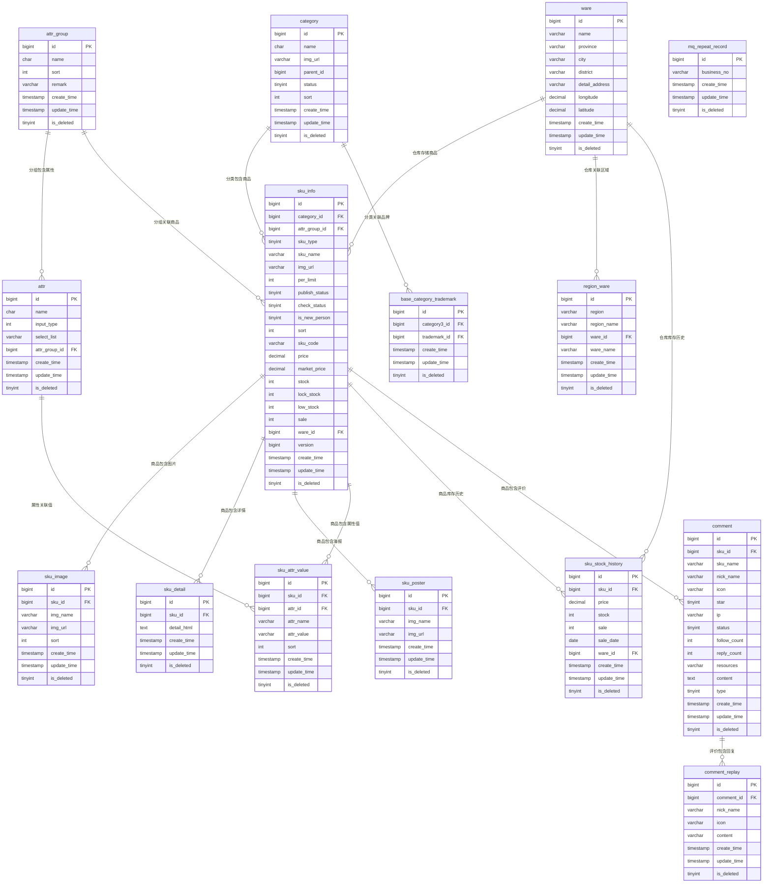
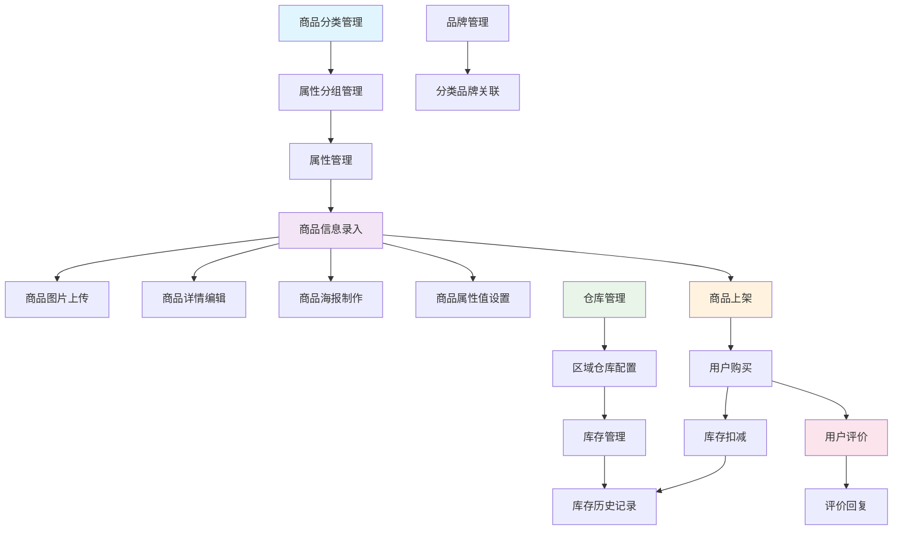

# 社区商城商品数据库关系图

## 数据库表关系图

## 业务流程图

## 表关系说明

### 1. 核心业务关系
- **商品分类** → **商品信息**：每个商品必须属于一个分类
- **属性分组** → **属性** → **商品属性值**：商品通过属性体系描述规格
- **商品信息** → **商品展示**：图片、详情、海报等展示信息

### 2. 库存管理关系
- **仓库** → **区域仓库**：仓库与销售区域的关联
- **商品** → **库存历史**：记录商品库存变化

### 3. 用户交互关系
- **商品** → **评价** → **评价回复**：完整的用户评价体系

### 4. 品牌管理关系
- **分类** → **品牌关联**：管理分类与品牌的关联关系

## 数据库设计特点

1. **模块化设计**：每个业务模块独立管理
2. **软删除**：所有表都支持软删除（is_deleted字段）
3. **审计字段**：统一的时间戳和版本控制
4. **灵活扩展**：属性体系支持动态扩展
5. **数据完整性**：通过外键保证数据一致性
